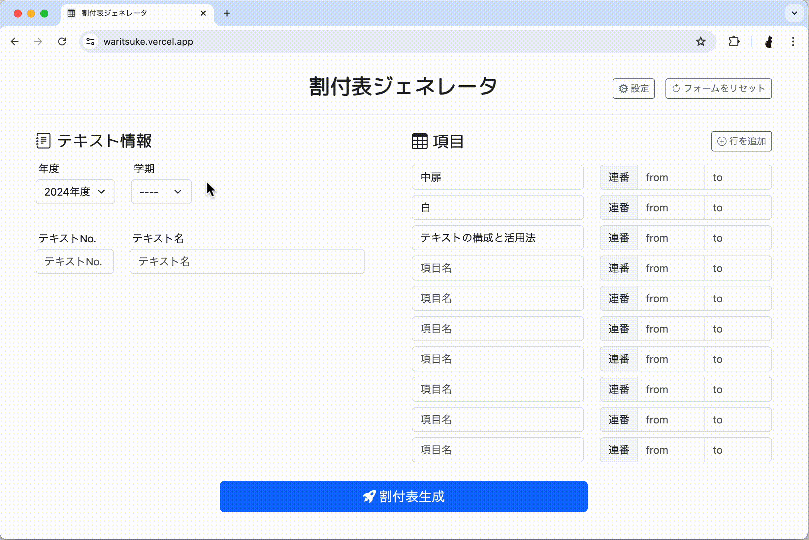

# 特長

- **Web アプリ化** ―「かんたん割付くん」の機能はそのままに、Web アプリ化しました。これにより、環境に左右されずに割付表を簡単に作成できるようになりました。
- **再設計されたデザイン** ― シンプルでモダンなデザインに刷新し、これまで以上に使いやすくなりました。また、レスポンシブデザインを採用したので、どんなデバイスからアクセスしても、最適な画面表示を提供します。
- **高速** ― 軽量なサイトなので、ページの読み込みは一瞬です。もう Excel の起動を待つ必要はありません。

# 使い方

フォームに適宜入力して、下部の「割付表生成」ボタンをクリックすると、入力内容にもとづいて生成された割付表 PDF が別タブで開きます。

## テキスト情報

- 年度、学期、テキスト No.、テキスト名を任意に入力します。
- 年度、学期を入れたくない場合は、`----`を選択してください。

## 項目

- 項目名と、それに付与する連番を任意に設定します。
- 上から順に処理されます。
- 空白行は無視されます。
- 項目名は省略できます。その場合、当該項目は連番のみ割付表に出力されます。
- 総ページ数は、最大 576 ページまで対応しています。

> [!TIP]
> 連番を設定する場合、`from`や`to`はどちらかを省略することができます。`from`を省略すると、`from = 1`として処理します。`to`を省略すると、`to = from`として処理します（つまり、１ページだけ割付表に出力します）。

## 設定

### 外観テーマ設定

- ページの外観を、ダークモードまたはライトモードに切り替えることができます。
  - この設定はブラウザに保存されます。

### 割付表設定

- 「割付表の末尾に"白"を自動追加」では、生成した割付表の末尾に白をどのように追加するのか設定します。
- 「割付表の右上に PDF 校了用の文言を追加」のスイッチを入れると、割付表の右上に、PDF 校了用の文言（PDF 部分がどこなのかを示す文言）が赤字で追加されます。
  - PDF の範囲は、３ページから最後のページ（自動追加された白を除く）までとして処理されます。

### 項目名サジェスト設定

- 項目名のサジェストを任意に設定することができます。
- ここで入力した内容は、ブラウザに保存され、次回以降も使用できます。
- 入力内容はブラウザでのみ処理し、サーバに送信することはありません。

# 開発環境

- VS Code
- Node.js v20.15.1
- macOS Sonoma 14.5 および Windows 10
